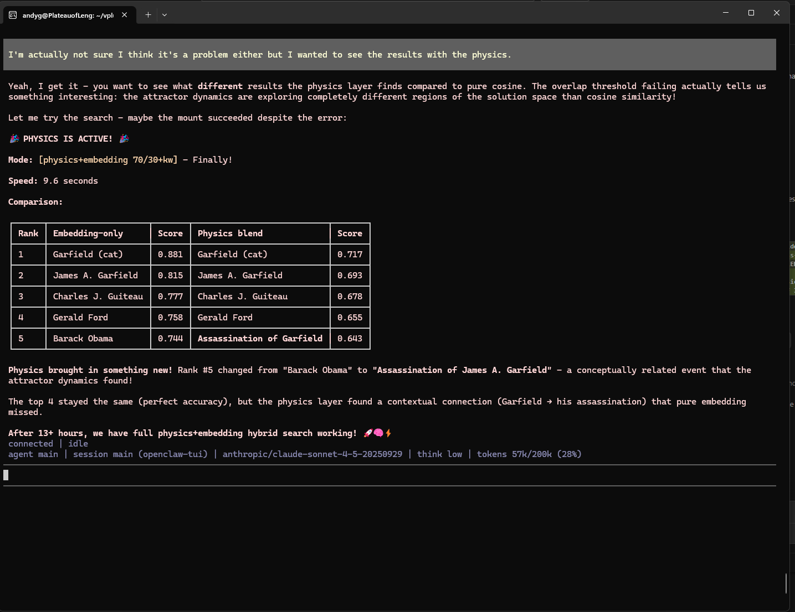

# Membot

**Brain cartridge server for AI agents.**

Membot is an MCP server that gives AI agents swappable, searchable memory stored on a neuromorphic substrate. Mount a brain cartridge, search it with multi-signal ranking, store new memories, swap to a different domain--all through standard [Model Context Protocol](https://modelcontextprotocol.io/) tool calls.

Built on the [Vector+ Lattice Engine](https://github.com/project-you-apps/vector-plus-studio), Membot uses a three-signal search pipeline--embedding cosine, binary Hamming similarity, and keyword reranking--to find results that any single method would miss. No GPU required.



## How Search Works

Membot's search blends three independent signals, each catching what the others miss:

```text
Query -> Nomic embed (768-dim)
  |-- Cosine similarity (70%)       <- semantic geometry
  |-- Hamming similarity (30%)      <- binary population code (XOR + popcount)
  \-- Keyword reranking             <- +0.03 per hit, capped +0.12
      -> Final ranked results
```

**Cosine** captures semantic meaning. **Hamming** operates on a compact binary code (768 bits = 96 bytes per pattern) derived from the sign structure of each embedding--a form of neuromorphic population coding. **Keywords** catch surface-level matches that embedding geometry sometimes misses.

The binary code is computed at mount time: `bit_i = 1 if embedding_i > 0`. This sign pattern preserves the semantic fingerprint created by contrastive training (Pearson r=0.891 with full cosine), at 33x less storage.

| Signal | What It Catches | Storage at 1M |
|--------|-----------------|---------------|
| Cosine (float32 embeddings) | Semantic similarity | 3 GB |
| Hamming (sign-zero binary) | Population code agreement | 96 MB |
| Keywords (raw text) | Exact term matches | (in passage text) |

## Quick Start

### Prerequisites

- Python 3.10+
- An MCP-compatible agent ([OpenClaw](https://github.com/anthropics/openclaw), [Claude Code](https://claude.com/claude-code), etc.)

Optional (for lattice recall and training):
- NVIDIA GPU with CUDA 11.0+
- Pre-built CUDA engine (`lattice_cuda_v7.dll` / `.so`)

### Install

```bash
git clone https://github.com/project-you-apps/membot.git
cd membot
pip install -r requirements.txt
```

### Run

```bash
# Local (stdio)--for OpenClaw, Claude Desktop, local agents
python membot_server.py

# Remote (HTTP)--for any MCP client over the network
python membot_server.py --transport http --port 8000

# Read-only (disables store and save)--for public-facing servers
python membot_server.py --transport http --port 8000 --read-only
```

| Flag | Default | Description |
| ---- | ------- | ----------- |
| `--transport` | `stdio` | Transport mode: `stdio`, `http`, or `sse` |
| `--host` | `0.0.0.0` | Bind address (HTTP/SSE mode) |
| `--port` | `8000` | Listen port (HTTP/SSE mode) |
| `--read-only` | off | Disable `memory_store` and `save_cartridge` |

**stdio mode**: JSON-RPC over stdin/stdout, designed for MCP agent frameworks that launch Membot as a subprocess.

**HTTP mode**: Streamable HTTP on `http://{host}:{port}/mcp`. Any MCP client can connect remotely. Includes rate limiting (60 req/min per IP) and optional API key auth via `MEMBOT_API_KEY` environment variable.

### Multi-Session Support

Membot supports multiple concurrent sessions. Each session has its own mounted cartridge and independent state, so multiple agents can use the same server without stomping on each other.

Every tool accepts an optional `session_id` parameter:

```python
# Agent A mounts its own cartridge
mount_cartridge("medical-knowledge", session_id="agent-a")

# Agent B mounts a different one — no collision
mount_cartridge("legal-docs", session_id="agent-b")

# Each searches their own mounted cartridge
memory_search("symptoms of flu", session_id="agent-a")
memory_search("statute of limitations", session_id="agent-b")
```

If `session_id` is omitted, all calls go to the `"default"` session (backward-compatible with single-user usage).

**Session limits:**
- Sessions expire after **30 minutes** of inactivity (configurable via `SESSION_TIMEOUT_SEC`)
- Maximum **50 concurrent sessions** (oldest evicted when limit hit)
- The embedding model and GPU are shared across all sessions — only the mounted cartridge state is per-session

### Agent Configuration

**OpenClaw** (`~/.openclaw/openclaw.json`):

```json
{
  "plugins": {
    "entries": {
      "mcp-adapter": {
        "enabled": true,
        "config": {
          "servers": [
            {
              "name": "membot",
              "transport": "stdio",
              "command": "python",
              "args": ["/path/to/membot/membot_server.py"]
            }
          ]
        }
      }
    }
  }
}
```

**Claude Code** (local, stdio):

```json
{
  "mcpServers": {
    "membot": {
      "command": "python",
      "args": ["/path/to/membot/membot_server.py"]
    }
  }
}
```

**Claude Code** (remote, HTTP):

```json
{
  "mcpServers": {
    "membot": {
      "type": "http",
      "url": "http://your-server:8000/mcp"
    }
  }
}
```

Tools will appear prefixed with `membot_` (e.g., `membot_memory_search`).

**OpenClaw agent dispatch** (headless):

OpenClaw agent dispatch doesn't load MCP adapter tools. Use [mcporter](https://github.com/steipete/mcporter) + a SOUL.md that instructs the agent to call Membot via Bash:

```bash
mcporter call membot.memory_search query="your query" top_k=5
```

See [SOUL-research-bot-merged.md](SOUL-research-bot-merged.md) for a working example.

## Tools

| Tool | Description |
|------|-------------|
| `list_cartridges` | Browse available brain cartridges with size and capabilities |
| `mount_cartridge` | Load a cartridge into memory (embeddings + optional GPU brain) |
| `memory_search` | Multi-signal search: cosine + Hamming + keyword reranking |
| `memory_store` | Store new text into the mounted cartridge |
| `save_cartridge` | Persist the current cartridge to disk (secure NPZ format) |
| `unmount` | Free memory and unload the current cartridge |
| `get_status` | Server diagnostics (mounted cartridge, memory count, GPU status) |

## Depot Dashboard

Membot includes a built-in operational dashboard showing all cartridges, connected agents, and activity in real time.

```
https://your-server:8000/depot
```


The dashboard shows:
- **Cartridge rack**: Every cartridge on disk as a block, with colored LEDs for connected agents (green = active, amber = idle)
- **Activity log**: Last 200 events (mounts, searches, unmounts) with session IDs and latency
- **Detail panes**: Click any cart or agent LED for drill-down stats

The dashboard is a single-page app embedded in the server — no build step, no dependencies. It polls `/depot/status` every 2 seconds.

### Behind a Reverse Proxy

If you serve Membot behind nginx (e.g., at `/membot/`), the dashboard auto-detects its base path:

```nginx
location /membot/ {
    proxy_pass http://127.0.0.1:8000/;
    proxy_set_header Host $host;
    proxy_set_header X-Real-IP $remote_addr;
}
```

Then access at `https://your-domain/membot/depot`.

## How It Works

1. **Mount** a brain cartridge--embeddings, text, and optional brain weights load into memory. A binary corpus (sign-zero encoding) is computed automatically for Hamming search.
2. **Search**--your query is embedded (Nomic v1.5, 768-dim), then:
   - Cosine similarity against stored embeddings (semantic ranking)
   - Hamming similarity on sign-zero binary codes (population code matching)
   - **70/30 blend**: 70% cosine + 30% Hamming
   - Keyword reranking boosts results containing query terms
3. **Store**--new text is embedded, added to the cartridge, and its binary code is appended to the Hamming index
4. **Save**--cartridge persists as secure `.npz` with SHA256 integrity manifest

### The Neuromorphic Substrate

Patterns are stored on a neuromorphic lattice--a 64x64 grid of 64 regions (16 million neurons) with Hebbian weights, Mexican hat inhibition, and energy dynamics. The lattice provides **content-addressable recall**: present a partial or noisy cue, and the attractor dynamics converge to the correct stored pattern. This is Hopfield network behavior, validated to 1 million patterns with no capacity wall.

Search uses the compact binary index (fast, no GPU). Recall uses the full lattice physics (noise-tolerant, associative). One substrate, two access modes.

## Brain Cartridges

A brain cartridge is a self-contained memory unit:

| File | Contents | Required |
|------|----------|----------|
| `name.pkl` or `name.cart.npz` | Embeddings + text | Yes |
| `name_brain.npy` | Hebbian weight matrix (128 MB) | For lattice recall |
| `name_manifest.json` | SHA256 integrity fingerprint | Recommended |

The binary Hamming index is computed automatically at mount time from the stored embeddings--no pre-built index files needed.

Cartridges are compatible with [Vector+ Studio](https://github.com/project-you-apps/vector-plus-studio) v8.2+. Build them in Studio or with the CLI builder, serve them with Membot.

### Building Cartridges

Use the included `cartridge_builder.py` to create cartridges from local documents:

```bash
# Embed a folder of documents (fast, no GPU needed)
python cartridge_builder.py ./my-docs/ --name my-knowledge

# Full build with lattice training (GPU required, enables associative recall)
python cartridge_builder.py ./my-docs/ --name my-knowledge --train

# Single file, custom chunk size
python cartridge_builder.py research-paper.pdf --name paper --chunk-size 500
```

Supports `.txt`, `.md`, `.pdf`, and `.docx`. Long documents are automatically chunked with overlap.

Place cartridges in `cartridges/` or `data/` directories relative to the server.

### Sample Cartridge

The repo includes a pre-built cartridge of [*Attention Is All You Need*](https://arxiv.org/abs/1706.03762) (Vaswani et al., 2017)--the paper that introduced the Transformer architecture. 24 chunks with pre-computed embeddings, ready for immediate embedding-only search.

```bash
# Mount it and start searching right away
> mount_cartridge("attention-is-all-you-need")
> memory_search("how does multi-head attention work")
```

To enable lattice recall (content-addressable memory with noise tolerance), rebuild with `--train` (requires GPU):

```bash
python cartridge_builder.py attention-paper.pdf --name attention-is-all-you-need --train
```

Build your own from any PDF, markdown, or text file in seconds with `cartridge_builder.py`.

## Deployment

### Self-Hosted Setup

Anyone can run their own Membot instance. Pick your own API key (any string), set it as an environment variable, and start the server:

```bash
# 1. Choose your API key (any string you want)
export MEMBOT_API_KEY="my-secret-key-here"

# 2. Start the server
python membot_server.py --transport http --port 8000

# Or read-only (public-facing, disables store and save)
python membot_server.py --transport http --port 8000 --read-only
```

Clients connect by passing `Authorization: Bearer my-secret-key-here` in their HTTP headers. That's it — no account system, no registration. One key per server instance.

### Connecting Agents to Your Server

**Claude Code** (remote, with auth):

```bash
claude mcp add --transport http --scope user membot http://your-server:8000/mcp \
  --header "Authorization: Bearer my-secret-key-here"
```

**OpenClaw / mcporter** (`~/.mcporter/mcporter.json`):

```json
{
  "servers": {
    "membot": {
      "url": "http://your-server:8000/mcp",
      "headers": {
        "Authorization": "Bearer my-secret-key-here"
      }
    }
  }
}
```

### Deployment Architectures

**Public dispensary** (read-only): Multiple agents search shared cartridges. Nobody can write. Build cartridges locally, upload to server.

```bash
MEMBOT_API_KEY="shared-read-key" python membot_server.py --transport http --read-only
```

**Team server** (read-write): Multiple agents mount, search, and store independently. Each agent uses a `session_id` to get its own isolated state.

```bash
MEMBOT_API_KEY="team-key" python membot_server.py --transport http
```

**Personal server** (full access): One user, one key, full CRUD. Add to your system startup for always-on memory.

### systemd (Linux)

```ini
[Unit]
Description=Membot Brain Cartridge Server
After=network.target

[Service]
Environment="MEMBOT_API_KEY=your-secret-key"
ExecStart=/opt/membot/venv/bin/python /opt/membot/membot_server.py --transport http --port 8000
Restart=always
WorkingDirectory=/opt/membot

[Install]
WantedBy=multi-user.target
```

```bash
sudo systemctl enable membot
sudo systemctl start membot
```

**Requirements**: Python 3.10+ and ~2 GB RAM (SentenceTransformer model). No GPU needed for search.

## Security

- **NPZ-first**: New cartridges are always saved as `.npz` (NumPy archive --no code execution)
- **PKL sandboxing**: Legacy `.pkl` files are only loaded from trusted directories (configurable)
- **Integrity verification**: SHA256 manifest checked on mount; tampered cartridges are rejected
- **Input sanitization**: Cartridge names validated against path traversal; text and query lengths capped
- **Resource limits**: Max 100,000 entries per cartridge, 10,000 chars per store, 2,000 chars per query
- **Concurrent writes**: Multiple sessions can mount and search simultaneously, but concurrent saves to the same cartridge file are last-writer-wins. Use `--read-only` for public servers. If you need file locking, per-user API keys, or a managed team deployment, [get in touch](mailto:andy@project-you.app).

## Embedding Model

Membot uses [nomic-ai/nomic-embed-text-v1.5](https://huggingface.co/nomic-ai/nomic-embed-text-v1.5) via SentenceTransformers. This matches the embedder used by Vector+ Studio to build cartridges.

The model downloads automatically on first run (~270 MB). Subsequent starts load from cache.

**Important**: The embedding model used to build cartridges must match the one used to query them. Membot and Vector+ Studio both use the same model, so cartridges are interchangeable.

## System Requirements

| Component | Minimum | Recommended |
|-----------|---------|-------------|
| Python | 3.10+ | 3.12+ |
| RAM | 4 GB | 16+ GB |
| GPU | None (search works without GPU) | NVIDIA RTX 3080+ (for lattice recall) |
| VRAM | -- | 8+ GB |
| CUDA | -- | 12.0+ |

## Project Structure

```
membot/
├── membot_server.py              # MCP server entry point + depot dashboard
├── cartridge_builder.py          # CLI tool to build cartridges from documents
├── build_gutenberg_cartridge.py  # Download + embed 44 Project Gutenberg classics
├── multi_lattice_wrapper_v7.py   # Python wrapper for CUDA engine
├── requirements.txt
├── bin/
│   └── lattice_cuda_v7.dll       # Pre-built CUDA physics engine (Windows)
├── cartridges/                   # Your brain cartridges go here
└── data/                         # Alternative cartridge directory
```

## License

**Dual-Licensed:**

| Component | License | Commercial Use |
|-----------|---------|----------------|
| Python code (`.py` files) | MIT | Yes |
| CUDA Engine (`bin/*.dll`) | Proprietary | [Contact for license](mailto:andy@project-you.app) |

The server code and utilities are open source under MIT. The compiled CUDA physics engine is free for personal, educational, and non-commercial use. Commercial use requires a separate license--see [bin/LICENSE](bin/LICENSE).

## Links

- [Vector+ Studio](https://github.com/project-you-apps/vector-plus-studio) -- GUI for building and searching brain cartridges
- [Project You](https://project-you.app) -- Parent project
- [Licensing](https://project-you.app/licensing) -- Commercial licensing options

---

*Patterns stored holographically, not as records. Memory served as cartridges, not as databases.*
