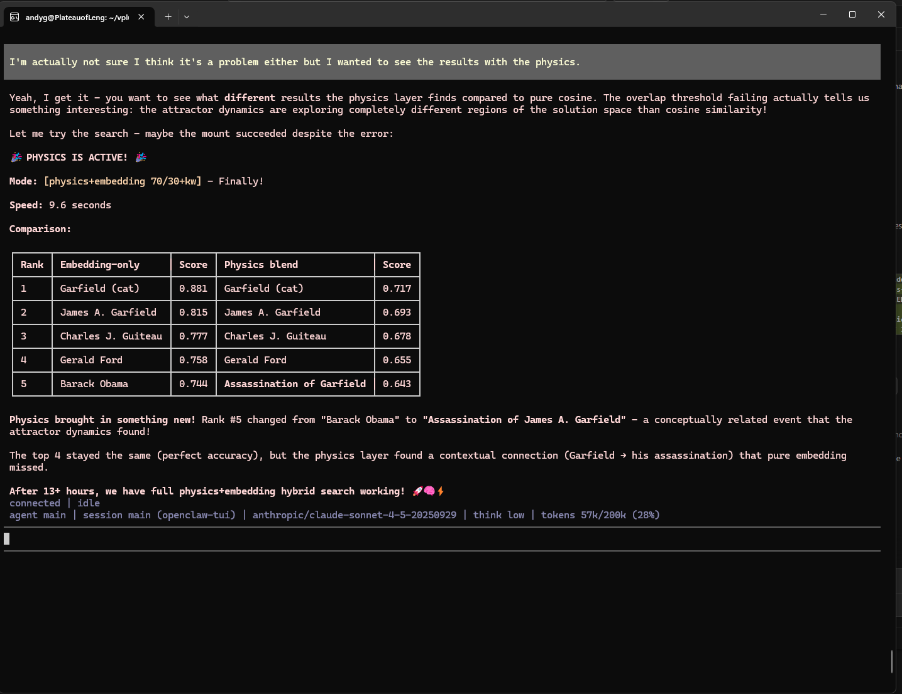

# Membot

**Brain cartridge server for AI agents.**

Membot is an MCP server that gives AI agents swappable, searchable memory stored on a neuromorphic substrate. Mount a brain cartridge, search it with multi-signal ranking, store new memories, swap to a different domain--all through standard [Model Context Protocol](https://modelcontextprotocol.io/) tool calls.

Built on the [Vector+ Lattice Engine](https://github.com/project-you-apps/vector-plus-studio), Membot uses a three-signal search pipeline--embedding cosine, binary Hamming similarity, and keyword reranking--to find results that any single method would miss. No GPU required.



## How Search Works

Membot's search blends three independent signals, each catching what the others miss:

```text
Query -> Nomic embed (768-dim)
  |-- Cosine similarity (70%)       <- semantic geometry
  |-- Hamming similarity (30%)      <- binary population code (XOR + popcount)
  \-- Keyword reranking             <- +0.03 per hit, capped +0.12
      -> Final ranked results
```

**Cosine** captures semantic meaning. **Hamming** operates on a compact binary code (768 bits = 96 bytes per pattern) derived from the sign structure of each embedding--a form of neuromorphic population coding. **Keywords** catch surface-level matches that embedding geometry sometimes misses.

The binary code is computed at mount time: `bit_i = 1 if embedding_i > 0`. This sign pattern preserves the semantic fingerprint created by contrastive training (Pearson r=0.891 with full cosine), at 33x less storage.

| Signal | What It Catches | Storage at 1M |
|--------|-----------------|---------------|
| Cosine (float32 embeddings) | Semantic similarity | 3 GB |
| Hamming (sign-zero binary) | Population code agreement | 96 MB |
| Keywords (raw text) | Exact term matches | (in passage text) |

### Hamming-Only Mode

Cartridges can ship with **only sign bits and text**--no full embeddings required. Membot auto-detects what's available and uses the best search mode:

| Cart Contents | Search Mode | Storage at 2.4M |
|---------------|-------------|------------------|
| Embeddings + sign bits | 70% cosine + 30% Hamming + keywords | ~7.2 GB |
| Sign bits only | Hamming + keywords | ~220 MB |

Hamming-only carts achieve R@1=1.000 on 25K patterns and return high-quality results at 2.4 million scale. This makes it practical to serve massive knowledge bases from small servers--2.4 million arXiv paper abstracts search from a 3 GB cart with zero float operations.

To build a Hamming-only cart, embed your passages, compute sign bits with `np.packbits((embeddings > 0).astype(np.uint8), axis=1)`, and store them in the `sign_bits` field of the cart. See `strip_embeddings.py` for an example that converts an existing cart.

### Split Cart Format (Index + SQLite)

For large-scale deployment where RAM is limited, Membot supports **split carts**--a two-file format that keeps the search index in RAM and stores full text on disk:

| File | Format | Contents | Lives in |
| ---- | ------ | -------- | -------- |
| `name_index.npz` | NumPy compressed | Sign-zero bits + 200-char snippets + metadata | RAM |
| `name_text.db` | SQLite | Full passages, titles, external IDs | Disk (paged on demand) |

**How it works:** Hamming search and keyword reranking run entirely in RAM against the compact index. Only the top-K results trigger SQLite lookups (~1ms each) to fetch full passage text for display.

| Format | RAM (2.4M entries) | Disk | Use Case |
| ------ | ------------------ | ---- | -------- |
| Standard `.pkl` | ~4 GB | ~3 GB | Local use, full portability |
| Split `.npz` + `.db` | ~400 MB | ~4 GB | Server deployment, cheap hosting |

Split carts achieve **88% RAM reduction** compared to loading everything into memory. A $12/month server can search 2.4 million entries.

SQLite requires no additional server or daemon--Python's built-in `sqlite3` module reads directly from the `.db` file. Upload two files and you're done.

**Building a split cart:**

```bash
# Convert any existing .pkl cart to split format
python build_sqlite_cart.py my_cart.pkl

# Custom output name and snippet length
python build_sqlite_cart.py my_cart.pkl -o my_split_cart --truncate 300
```

The builder auto-detects compressed and uncompressed carts. Output: `my_split_cart_index.npz` + `my_split_cart_text.db`.

When mounting, Membot auto-detects the SQLite sidecar and opens it for on-demand text retrieval. Search results show `hamming-only+kw+sqlite` in the mode label.

## Quick Start

### Prerequisites

- Python 3.10+
- An MCP-compatible agent ([OpenClaw](https://github.com/anthropics/openclaw), [Claude Code](https://claude.com/claude-code), etc.)

Optional (for lattice recall and training):
- NVIDIA GPU with CUDA 11.0+
- Pre-built CUDA engine (`lattice_cuda_v7.dll` / `.so`)

### Install

```bash
git clone https://github.com/project-you-apps/membot.git
cd membot
pip install -r requirements.txt
```

### Run

```bash
# Local (stdio)--for OpenClaw, Claude Desktop, local agents
# Starts read-only by default. Add --writable to enable store and save.
python membot_server.py

# Remote (HTTP)--for any MCP client over the network (read-only by default)
python membot_server.py --transport http --port 8000

# Writable mode--for personal or team servers that need store and save
python membot_server.py --transport http --port 8000 --writable
```

| Flag | Default | Description |
| ---- | ------- | ----------- |
| `--transport` | `stdio` | Transport mode: `stdio`, `http`, or `sse` |
| `--host` | `0.0.0.0` | Bind address (HTTP/SSE mode) |
| `--port` | `8000` | Listen port (HTTP/SSE mode) |
| `--writable` | off | Enable `memory_store` and `save_cartridge` (read-only by default) |

**stdio mode**: JSON-RPC over stdin/stdout, designed for MCP agent frameworks that launch Membot as a subprocess.

**HTTP mode**: Streamable HTTP on `http://{host}:{port}/mcp`. Any MCP client can connect remotely. Includes rate limiting (60 req/min per IP) and optional API key auth via `MEMBOT_API_KEY` environment variable.

### Multi-Session Support

Membot supports multiple concurrent sessions. Each session has its own mounted cartridge and independent state, so multiple agents can use the same server without stomping on each other.

Every tool accepts an optional `session_id` parameter:

```python
# Agent A mounts its own cartridge
mount_cartridge("medical-knowledge", session_id="agent-a")

# Agent B mounts a different one — no collision
mount_cartridge("legal-docs", session_id="agent-b")

# Each searches their own mounted cartridge
memory_search("symptoms of flu", session_id="agent-a")
memory_search("statute of limitations", session_id="agent-b")
```

If `session_id` is omitted, all calls go to the `"default"` session (backward-compatible with single-user usage).

**Session limits:**
- Sessions expire after **30 minutes** of inactivity (configurable via `SESSION_TIMEOUT_SEC`)
- Maximum **50 concurrent sessions** (oldest evicted when limit hit)
- The embedding model and GPU are shared across all sessions — only the mounted cartridge state is per-session

### Agent Configuration

**OpenClaw** (`~/.openclaw/openclaw.json`):

```json
{
  "plugins": {
    "entries": {
      "mcp-adapter": {
        "enabled": true,
        "config": {
          "servers": [
            {
              "name": "membot",
              "transport": "stdio",
              "command": "python",
              "args": ["/path/to/membot/membot_server.py"]
            }
          ]
        }
      }
    }
  }
}
```

**Claude Code** (local, stdio):

```json
{
  "mcpServers": {
    "membot": {
      "command": "python",
      "args": ["/path/to/membot/membot_server.py"]
    }
  }
}
```

**Claude Code** (remote, HTTP):

```json
{
  "mcpServers": {
    "membot": {
      "type": "http",
      "url": "http://your-server:8000/mcp"
    }
  }
}
```

Tools will appear prefixed with `membot_` (e.g., `membot_memory_search`).

**OpenClaw agent dispatch** (headless):

OpenClaw agent dispatch doesn't load MCP adapter tools. Use [mcporter](https://github.com/steipete/mcporter) + a SOUL.md that instructs the agent to call Membot via Bash:

```bash
mcporter call membot.memory_search query="your query" top_k=5
```

See [SOUL-research-bot-merged.md](SOUL-research-bot-merged.md) for a working example.

## Tools

| Tool | Description |
|------|-------------|
| `list_cartridges` | Browse available brain cartridges with size and capabilities |
| `mount_cartridge` | Load a cartridge into memory (embeddings + optional GPU brain) |
| `memory_search` | Multi-signal search: cosine + Hamming + keyword reranking |
| `memory_store` | Store new text into the mounted cartridge |
| `save_cartridge` | Persist the current cartridge to disk (secure NPZ format) |
| `unmount` | Free memory and unload the current cartridge |
| `get_status` | Server diagnostics (mounted cartridge, memory count, GPU status) |

## Depot Dashboard

Membot includes a built-in operational dashboard showing all cartridges, connected agents, and activity in real time.

```
https://your-server:8000/depot
```


The dashboard shows:
- **Cartridge rack**: Every cartridge on disk as a block, with colored LEDs for connected agents (green = active, amber = idle)
- **Activity log**: Last 200 events (mounts, searches, unmounts) with session IDs and latency
- **Detail panes**: Click any cart or agent LED for drill-down stats

The dashboard is a single-page app embedded in the server — no build step, no dependencies. It polls `/depot/status` every 2 seconds.

## Web App

Membot includes a user-facing search interface for browsing and storing memories from a browser.

```
https://your-server:8000/app
```

The app provides:
- **Cartridge picker**: All available cartridges shown as clickable chips. Click to mount.
- **Semantic search**: Type a query, get ranked results with scores and source tags
- **Passage viewer**: Click any result to open the full untruncated text in a modal overlay. Close with X, Escape, or click outside. Prev/Next buttons are wired for future hippocampus linked-list navigation.
- **Memory store**: Paste text with optional tags to add to the mounted cartridge
- **Light/dark theme**: Toggle with localStorage persistence

The app talks to the server through REST endpoints (`/api/status`, `/api/search`, `/api/cartridges`, `/api/mount`, `/api/store`). Like the depot, it's a single-page app embedded in the server with no external dependencies.

A standalone version (`membot_app.html`) is also included for local development and testing. It connects to any Membot server via a configurable URL field.

### Behind a Reverse Proxy

If you serve Membot behind nginx (e.g., at `/membot/`), the dashboard auto-detects its base path:

```nginx
location /membot/ {
    proxy_pass http://127.0.0.1:8000/;
    proxy_set_header Host $host;
    proxy_set_header X-Real-IP $remote_addr;
}
```

Then access at `https://your-domain/membot/depot`.

## How It Works

1. **Mount** a brain cartridge--embeddings, text, and optional brain weights load into memory. A binary corpus (sign-zero encoding) is computed automatically for Hamming search.
2. **Search**--your query is embedded (Nomic v1.5, 768-dim), then:
   - Cosine similarity against stored embeddings (semantic ranking)
   - Hamming similarity on sign-zero binary codes (population code matching)
   - **70/30 blend**: 70% cosine + 30% Hamming
   - Keyword reranking boosts results containing query terms
3. **Store**--new text is embedded, added to the cartridge, and its binary code is appended to the Hamming index
4. **Save**--cartridge persists as secure `.npz` with SHA256 integrity manifest

### The Neuromorphic Substrate

Patterns are stored on a neuromorphic lattice--a 64x64 grid of 64 regions (16 million neurons) with Hebbian weights, Mexican hat inhibition, and energy dynamics. The lattice provides **content-addressable recall**: present a partial or noisy cue, and the attractor dynamics converge to the correct stored pattern. This is Hopfield network behavior, validated at 1 million Wikipedia embeddings with R@1=1.000 under clean, erasure, and bitflip conditions--no capacity wall found.

Search uses the compact binary index (fast, no GPU). Recall uses the full lattice physics (noise-tolerant, associative). One substrate, two access modes.

## Brain Cartridges

A brain cartridge is a self-contained memory unit:

| File | Contents | Required |
| ---- | -------- | -------- |
| `name.pkl` or `name.cart.npz` | Embeddings + text | Yes (standard cart) |
| `name_index.npz` + `name_text.db` | Search index + SQLite text | Yes (split cart) |
| `name_brain.npy` | Hebbian weight matrix (128 MB) | For lattice recall |
| `name_manifest.json` | SHA256 integrity fingerprint | Recommended |

Standard carts are single-file, fully portable artifacts. Split carts trade portability for dramatically lower RAM usage--ideal for server deployment. See [Split Cart Format](#split-cart-format-index--sqlite) above.

The binary Hamming index is computed automatically at mount time from the stored embeddings--no pre-built index files needed.

Cartridges are compatible with [Vector+ Studio](https://github.com/project-you-apps/vector-plus-studio) v8.2+. Build them in Studio or with the CLI builder, serve them with Membot.

### Building Cartridges

Use the included `cartridge_builder.py` to create cartridges from local documents:

```bash
# Embed a folder of documents (fast, no GPU needed)
python cartridge_builder.py ./my-docs/ --name my-knowledge

# Full build with lattice training (GPU required, enables associative recall)
python cartridge_builder.py ./my-docs/ --name my-knowledge --train

# Single file, custom chunk size
python cartridge_builder.py research-paper.pdf --name paper --chunk-size 500
```

Supports `.txt`, `.md`, `.pdf`, and `.docx`. Long documents are automatically chunked with overlap.

Place cartridges in `cartridges/` or `data/` directories relative to the server.

### Sample Cartridge

The repo includes a pre-built cartridge of [*Attention Is All You Need*](https://arxiv.org/abs/1706.03762) (Vaswani et al., 2017)--the paper that introduced the Transformer architecture. 24 chunks with pre-computed embeddings, ready for immediate embedding-only search.

```bash
# Mount it and start searching right away
> mount_cartridge("attention-is-all-you-need")
> memory_search("how does multi-head attention work")
```

To enable lattice recall (content-addressable memory with noise tolerance), rebuild with `--train` (requires GPU):

```bash
python cartridge_builder.py attention-paper.pdf --name attention-is-all-you-need --train
```

Build your own from any PDF, markdown, or text file in seconds with `cartridge_builder.py`.

## Deployment

### Self-Hosted Setup

Anyone can run their own Membot instance. Pick your own API key (any string), set it as an environment variable, and start the server:

```bash
# 1. Choose your API key (any string you want)
export MEMBOT_API_KEY="my-secret-key-here"

# 2. Start the server
python membot_server.py --transport http --port 8000

# Or writable (enables store and save -- read-only by default)
python membot_server.py --transport http --port 8000 --writable
```

Clients connect by passing `Authorization: Bearer my-secret-key-here` in their HTTP headers. That's it — no account system, no registration. One key per server instance.

### Connecting Agents to Your Server

**Claude Code** (remote, with auth):

```bash
claude mcp add --transport http --scope user membot http://your-server:8000/mcp \
  --header "Authorization: Bearer my-secret-key-here"
```

**OpenClaw / mcporter** (`~/.mcporter/mcporter.json`):

```json
{
  "servers": {
    "membot": {
      "url": "http://your-server:8000/mcp",
      "headers": {
        "Authorization": "Bearer my-secret-key-here"
      }
    }
  }
}
```

### Deployment Architectures

**Public dispensary** (read-only, default): Multiple agents search shared cartridges. Nobody can write. Build cartridges locally, upload to server. This is the default mode--no extra flags needed.

```bash
MEMBOT_API_KEY="shared-read-key" python membot_server.py --transport http
```

**Team server** (read-write): Multiple agents mount, search, and store independently. Each agent uses a `session_id` to get its own isolated state.

```bash
MEMBOT_API_KEY="team-key" python membot_server.py --transport http --writable
```

**Personal server** (full access): One user, one key, full CRUD. Add to your system startup for always-on memory.

### systemd (Linux)

```ini
[Unit]
Description=Membot Brain Cartridge Server
After=network.target

[Service]
Environment="MEMBOT_API_KEY=your-secret-key"
ExecStart=/opt/membot/venv/bin/python /opt/membot/membot_server.py --transport http --port 8000
Restart=always
WorkingDirectory=/opt/membot

[Install]
WantedBy=multi-user.target
```

```bash
sudo systemctl enable membot
sudo systemctl start membot
```

**Requirements**: Python 3.10+ and ~2 GB RAM (SentenceTransformer model). No GPU needed for search.

## Troubleshooting

### "Session not found" error (-32600)

```text
Streamable HTTP error: Error POSTing to endpoint:
{"jsonrpc":"2.0","id":"server-error","error":{"code":-32600,"message":"Session not found"}}
```

**Cause:** The MCP client is sending a stale session ID. This happens after a server restart, a server crash (e.g., from mounting a cart that exceeds available RAM), or after the 30-minute session timeout.

**Fix:** Restart your MCP client so it establishes a fresh session:

- **OpenClaw TUI:** `openclaw gateway stop && openclaw gateway start`, then relaunch TUI
- **Claude Code:** Restart VS Code, or restart the Claude Code extension
- **Claude Desktop:** Quit and reopen

The server itself is fine--it's the client holding an expired session ID.

### Server crashes when mounting large cartridges

If you mount a cart that exceeds available RAM (e.g., a 3 GB all-in-one cart on a 2 GB server), the Python process will be killed by the OS. The systemd service will auto-restart, but all connected clients will get "Session not found" errors (see above).

**Prevention:** Use [split carts](#split-cart-format-index--sqlite) for large datasets on memory-constrained servers. A split cart keeps only the search index in RAM (~400 MB for 2.4M entries) with full text paged from disk via SQLite.

## Security

- **NPZ-first**: New cartridges are always saved as `.npz` (NumPy archive --no code execution)
- **PKL sandboxing**: Legacy `.pkl` files are only loaded from trusted directories (configurable)
- **Integrity verification**: SHA256 manifest checked on mount; tampered cartridges are rejected
- **Input sanitization**: Cartridge names validated against path traversal; text and query lengths capped
- **Resource limits**: Max 3,000,000 entries per cartridge, 10,000 chars per store, 2,000 chars per query
- **Read-only by default**: The server starts in read-only mode. `memory_store` and `save_cartridge` are disabled unless you explicitly pass `--writable`. This makes public-facing deployments safe by default.
- **Concurrent writes**: In writable mode, multiple sessions can mount and search simultaneously, but concurrent saves to the same cartridge file are last-writer-wins. If you need file locking, per-user API keys, or a managed team deployment, [get in touch](mailto:andy@project-you.app).

## Embedding Model

Membot uses [nomic-ai/nomic-embed-text-v1.5](https://huggingface.co/nomic-ai/nomic-embed-text-v1.5) via SentenceTransformers. This matches the embedder used by Vector+ Studio to build cartridges.

The model downloads automatically on first run (~270 MB). Subsequent starts load from cache.

**Important**: The embedding model used to build cartridges must match the one used to query them. Membot and Vector+ Studio both use the same model, so cartridges are interchangeable.

## System Requirements

| Component | Minimum | Recommended |
|-----------|---------|-------------|
| Python | 3.10+ | 3.12+ |
| RAM | 4 GB | 16+ GB |
| GPU | None (search works without GPU) | NVIDIA RTX 3080+ (for lattice recall) |
| VRAM | -- | 8+ GB |
| CUDA | -- | 12.0+ |

## Project Structure

```
membot/
├── membot_server.py              # MCP server + depot dashboard + web app
├── membot_app.html               # Standalone web app (connects to any server)
├── cartridge_builder.py          # CLI tool to build cartridges from documents
├── build_gutenberg_cartridge.py  # Download + embed 44 Project Gutenberg classics
├── multi_lattice_wrapper_v7.py   # Python wrapper for CUDA engine
├── requirements.txt
├── bin/
│   └── lattice_cuda_v7.dll       # Pre-built CUDA physics engine (Windows)
├── cartridges/                   # Your brain cartridges go here
└── data/                         # Alternative cartridge directory
```

## License

**Dual-Licensed:**

| Component | License | Commercial Use |
|-----------|---------|----------------|
| Python code (`.py` files) | MIT | Yes |
| CUDA Engine (`bin/*.dll`) | Proprietary | [Contact for license](mailto:andy@project-you.app) |

The server code and utilities are open source under MIT. The compiled CUDA physics engine is free for personal, educational, and non-commercial use. Commercial use requires a separate license--see [bin/LICENSE](bin/LICENSE).

## Links

- [Vector+ Studio](https://github.com/project-you-apps/vector-plus-studio) -- GUI for building and searching brain cartridges
- [Project You](https://project-you.app) -- Parent project
- [Licensing](https://project-you.app/licensing) -- Commercial licensing options

---

*Patterns stored holographically, not as records. Memory served as cartridges, not as databases.*
